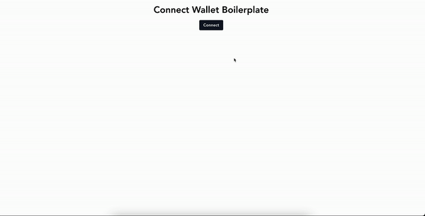

# Wallet Connection Boilerplate in React

<p align="center"></p>

## Wallet Supported

- Metamask
- WalletConnect

## Features

- Connect to Wallet (Metamask, WalletConnect, more coming soon)
- Network Change Detection
- Account Change Detection
- Disconnect from Wallet
- Sign Message
- Connect to smart contract
- Remove listener
- Switch Network

## How to use

### 1. Clone this repo using

```jsx
git clone https://github.com/starc007/wallet-connect-boilerplate.git
```

### 2. Move to the appropriate directory:

```jsx
cd wallet-connect-boilerplate
```

### 3. Run

```jsx
npm install
```

### 4. Start

```jsx
npm run dev
```

## Upcoming Features

- will add boilerplate for other Frontend Frameworks

## Support

If you like this project, please consider giving it a ⭐️ on Github and sharing it with your friends via social media.

## License

MIT
